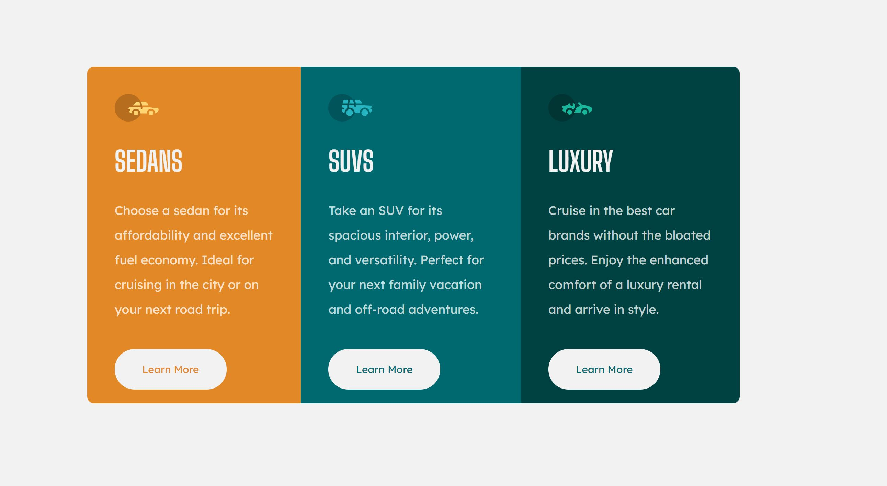

# 3 Column component card

This is a solution to the [3-column preview card component challenge on Frontend Mentor](https://www.frontendmentor.io/challenges/3column-preview-card-component-pH92eAR2-).

This challenge is to practice using flex box.

## Technologies Used

- HTML Structure
- Basic CSS Properties:
  - universal selector
  - background color
  - pseudo class (link, visited, hover and active)
  - flex display (direction variation from row to column)
  - media queries with several screen widths

- Google Fonts

## Links

- **Solution URL:** https://github.com/J-B-R-93/3-column-preview-card-component

- **Live Site URL:** https://j-b-r-93.github.io/3-column-preview-card-component/

## Screenshot

